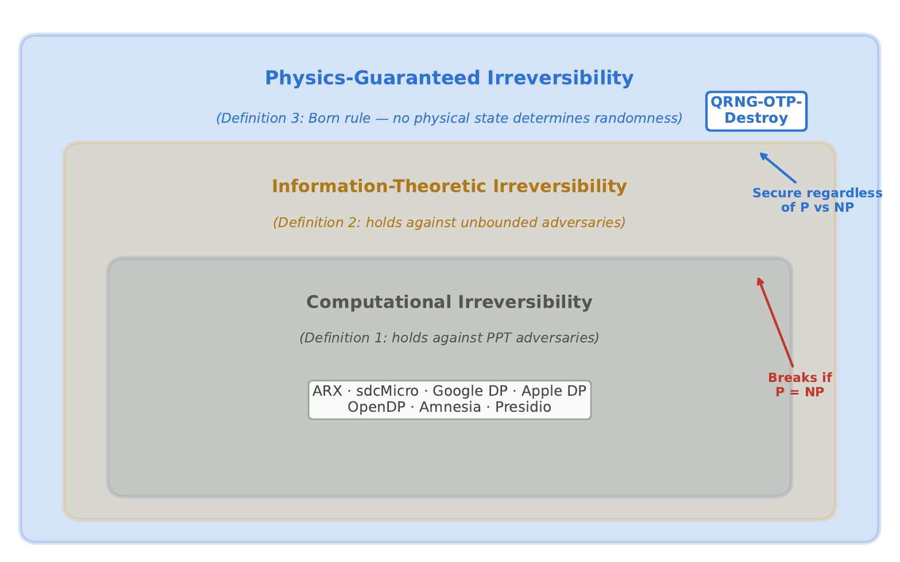
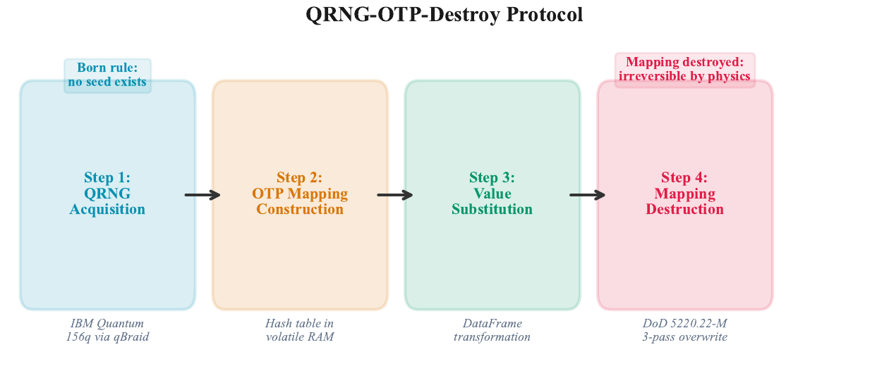
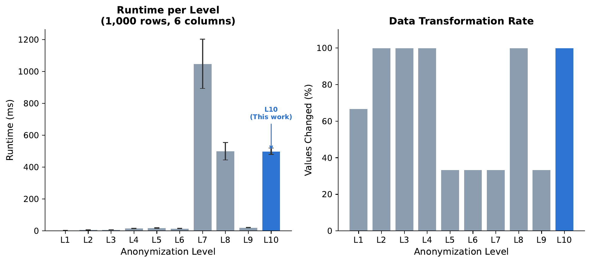
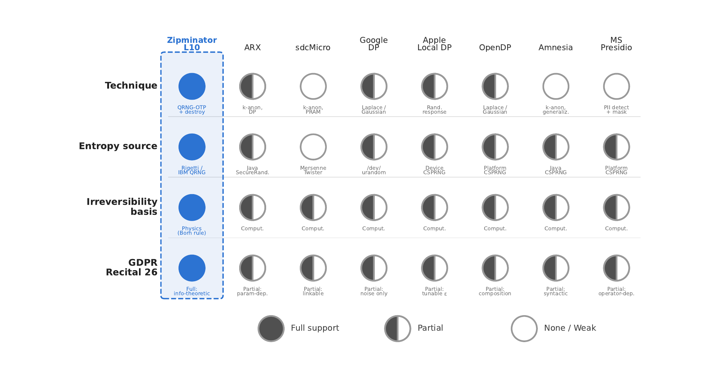
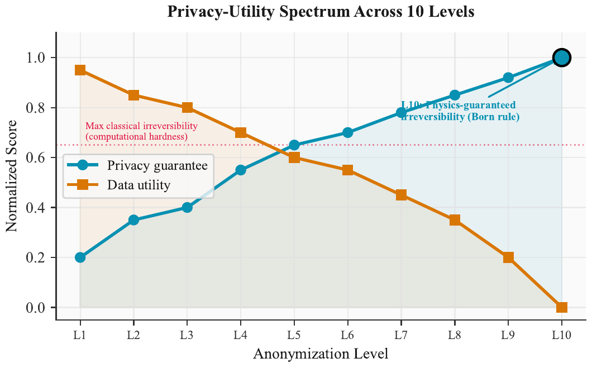
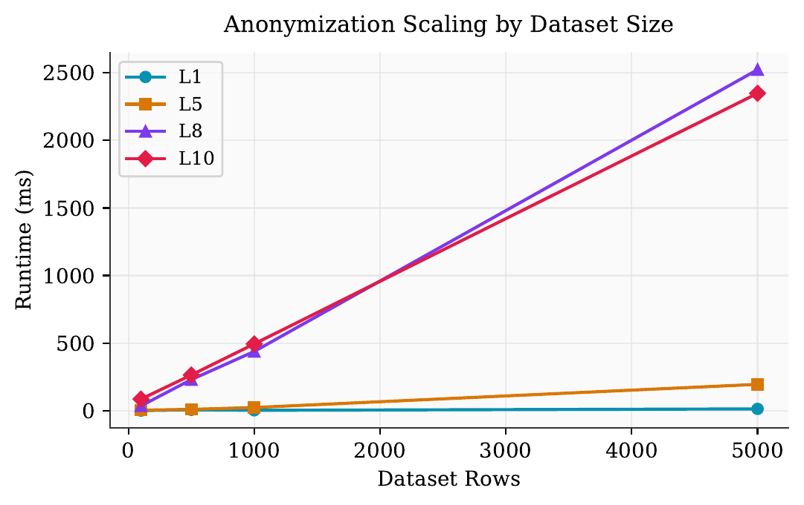

<p align="center">
  <h1 align="center">Quantum-Certified Anonymization</h1>
  <p align="center"><em>Irreversibility Beyond Computational Hardness</em></p>
</p>

<p align="center">
  <a href="https://github.com/QDaria/quantum-certified-anonymization/blob/main/main.pdf"></a>
  <a href="https://pypi.org/project/zipminator/"></a>
  <a href="https://github.com/QDaria/quantum-certified-anonymization/blob/main/LICENSE"></a>
  <a href="https://orcid.org/0009-0008-2270-5454"></a>
  
  
  <a href="https://doi.org/10.5281/zenodo.19437010"></a>
</p>

---

**Daniel Mo Houshmand**
[QDaria Quantum Research](https://qdaria.com), Oslo, Norway

## Abstract

We present the first data anonymization system whose irreversibility is guaranteed by the **Born rule of quantum mechanics** rather than by computational hardness assumptions. Every deployed anonymization tool derives its randomness from a classical PRNG; an adversary who captures the PRNG state can reconstruct every "random" value and reverse the anonymization completely. We introduce **QRNG-OTP-Destroy**, a protocol that replaces each personally identifiable value with a quantum-random token and irreversibly destroys the mapping. Because quantum measurement outcomes are governed by the Born rule, no deterministic seed exists, and the anonymization is information-theoretically irreversible against adversaries with unbounded computational power.

We formalize **three tiers of irreversibility** (computational, information-theoretic, and physics-guaranteed), prove that no classical PRNG-based method achieves the strongest tier, and prove that QRNG-OTP-Destroy does. We report on an implementation with **10 progressive anonymization levels** and a multi-provider entropy architecture (Rigetti, IBM Quantum, qBraid) with automatic failover to OS entropy. We validate the implementation with **966 unit and integration tests**, evaluate it on the UCI Adult dataset (32,561 records), and demonstrate production-scale quantum entropy harvesting (**6.8 MB from 35 IBM Quantum jobs** on 156-qubit processors).

## Key Contributions

| # | Contribution | Formal Result |
|---|---|---|
| 1 | Three-tier irreversibility hierarchy | Lemma 1, Theorems 1-2 |
| 2 | Game-based security definition with zero adversarial advantage | Theorem 9 |
| 3 | 10 progressive anonymization levels (L1-L10) | Section 4 |
| 4 | Multi-provider quantum entropy pool (6.8 MB real quantum entropy) | Section 5 |
| 5 | GDPR Recital 26 compliance argument with auditable provenance | Section 7 |
| 6 | Open-source implementation with 966 tests | Section 5.1 |

## Figures

<table>
<tr>
<td width="50%">

**Fig. 1: Three-Tier Irreversibility Hierarchy**

*Computational irreversibility breaks if P = NP. Physics-guaranteed irreversibility holds regardless of computational advances.*

</td>
<td width="50%">

**Fig. 3: QRNG-OTP-Destroy Protocol**

*Data flows through PII detection, level selection (L1-L10), quantum entropy acquisition, OTP mapping, substitution, and secure destruction.*

</td>
</tr>
<tr>
<td width="50%">

**Fig. 5: Runtime and Transformation Coverage**

*Left: mean runtime per level (1,000 rows). Right: percentage of values transformed. L10 transforms 100% of values.*

</td>
<td width="50%">

**Fig. 7: Guarantee Comparison Across Tools**

*Only QRNG-OTP-Destroy provides physics-guaranteed irreversibility; all others rely on computational hardness.*

</td>
</tr>
<tr>
<td width="50%">

**Fig. 8: Privacy-Utility Spectrum**

*Privacy-utility trade-off across 10 anonymization levels. Dashed line: maximum irreversibility achievable with classical methods.*

</td>
<td width="50%">

**Fig. 6: Runtime Scaling**

*Runtime scaling from 100 to 5,000 rows for L1, L5, L8, L10. QRNG-dependent levels scale linearly with unique values.*

</td>
</tr>
</table>

> All 14 figures available in [`figures/`](figures/) (PDF) and [`images/`](images/) (PNG).

## Paper Structure

| Section | Title | Content |
|---------|-------|---------|
| 1 | Introduction | HNDL threat, PRNG vulnerability, Born rule guarantee |
| 2 | Threat Model | Four adversary classes (A1-A4), game-based definitions |
| 3 | Three-Tier Framework | Computational, information-theoretic, physics-guaranteed |
| 4 | Protocol Design | QRNG-OTP-Destroy, 10 anonymization levels |
| 5 | Implementation | Multi-provider entropy, 966 tests, Zipminator SDK |
| 6 | Evaluation | UCI Adult (32,561 rows), runtime benchmarks, scaling |
| 7 | GDPR Analysis | Recital 26, provenance chain, DORA Art. 7 |
| 8 | Comparison | vs. k-anonymity, l-diversity, t-closeness, DP, ARX |
| 9 | Discussion | Limitations, quantum hardware costs, future work |

## Building the Paper

```bash
# Prerequisites: LaTeX distribution (TeX Live 2024+)
pdflatex main.tex
pdflatex main.tex   # second pass for cross-references
```

The pre-compiled PDF is available at [`main.pdf`](main.pdf).

## Implementation

The full Zipminator SDK (anonymization engine, entropy pool, multi-provider QRNG) is open-source:

```bash
pip install zipminator[all]
```

```python
from zipminator import Anonymizer

anon = Anonymizer(level=10)  # Physics-guaranteed irreversibility
result = anon.anonymize(dataframe)
```

Source: [QDaria/zipminator](https://github.com/QDaria/zipminator) | PyPI: [zipminator](https://pypi.org/project/zipminator/)

## Related Papers

This paper is part of a three-paper series on post-quantum entropy infrastructure:

1. **This paper** - Quantum-Certified Anonymization
2. [Unilateral WiFi CSI as a NIST-Validated Entropy Source](https://github.com/QDaria/unilateral-csi-entropy) - CSI entropy extraction + PUEK
3. [Certified Heterogeneous Entropy with Algebraic Randomness Extraction](https://github.com/QDaria/certified-heterogeneous-entropy) - Multi-source entropy composition + ARE

## Patent

Norwegian Patent Application No. **20260384**, filed 24 March 2026 (Patentstyret). 15 claims covering the QRNG-OTP-Destroy protocol and quantum-certified anonymization framework.

## Citation

```bibtex
@misc{houshmand2026quantum,
  author       = {Houshmand, Daniel Mo},
  title        = {Quantum-Certified Anonymization: Irreversibility Beyond Computational Hardness},
  year         = {2026},
  doi          = {10.5281/zenodo.19437010},
  url          = {https://doi.org/10.5281/zenodo.19437010},
}
```

## License

[Apache-2.0](LICENSE)
